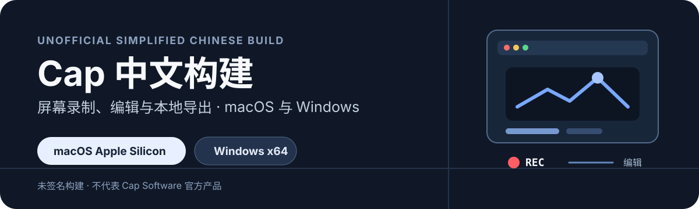

<p align="center">
  
</p>

<p align="center">
  <a href="#下载">下载</a> · <a href="#安装">安装</a> · <a href="#功能与服务边界">功能边界</a> · <a href="#从源码构建">从源码构建</a> · <a href="README_CN.md">详细中文说明</a>
</p>

> [!IMPORTANT]
> 这是基于 [CapSoftware/Cap](https://github.com/CapSoftware/Cap) 的非官方简体中文构建，与 Cap Software 没有隶属、合作或认可关系。Cap 名称、标志和商标归其权利人所有；安装包未使用官方代码签名，也不包含官方订阅权益或技术支持。

## 下载

| 平台 | 当前构建 | 下载入口 | 适用设备 |
| --- | --- | --- | --- |
| macOS | `Cap 中文版_0.5.9_aarch64.dmg` | [下载 macOS 安装包](https://github.com/fxbillu/cap-cn-local/releases/download/v0.5.9-cn.1/Cap%20%E4%B8%AD%E6%96%87%E7%89%88_0.5.9_aarch64.dmg) | Apple Silicon（M1/M2/M3/M4） |
| Windows | `Cap 中文版_0.5.9_x64-setup.exe` | [下载 Windows 安装包](https://github.com/fxbillu/cap-cn-local/releases/download/v0.5.9-cn.1/Cap%20%E4%B8%AD%E6%96%87%E7%89%88_0.5.9_x64-setup.exe) | 64 位 Intel / AMD Windows |

下载页：[v0.5.9-cn.1](https://github.com/fxbillu/cap-cn-local/releases/tag/v0.5.9-cn.1)。这是长期 Release 附件，不依赖会过期的 Actions Artifact。

## 安装

### macOS（Apple Silicon）

1. 下载 `Cap 中文版_0.5.9_aarch64.dmg` 并打开。
2. 将 `Cap 中文版.app` 拖入“应用程序”。
3. 首次打开时，macOS 可能提示“无法验证开发者”。在“系统设置 → 隐私与安全性”中选择仍要打开。
4. 按应用引导授权屏幕录制、麦克风、摄像头和辅助功能权限。没有这些权限，录制功能无法正常工作。

### Windows（x64）

1. 下载并运行 `Cap 中文版_0.5.9_x64-setup.exe`。
2. SmartScreen 可能因未签名而提示风险；只有在确认下载来源是本仓库构建页面后，才选择继续安装。
3. 首次录制时，按引导授予屏幕、麦克风和摄像头权限。

## 这是什么

Cap 是一款屏幕录制与编辑工具。本分支重点提供桌面端可见界面的简体中文本地化，并保留本地录制、编辑、导出、截图、摄像头、系统音频、时间轴、字幕及自定义 S3 / 自托管连接等能力。

中文词典位于 [`apps/desktop/src/i18n/zh-CN.ts`](apps/desktop/src/i18n/zh-CN.ts)。同步上游后可运行：

```bash
pnpm desktop:i18n:check
```

该检查会列出尚未进入中文词典的新界面文案。

## 功能与服务边界

桌面端的录制、编辑和导出可在本地完成；分享链接、在线转写、AI 标题与摘要、评论、分析、团队空间等能力依赖 Cap Web 与对应服务。

- 连接 `https://cap.so` 时，能力由你的官方账户和许可证决定。
- 连接自己的 Cap Web 时，需要自行维护 Web、数据库、对象存储和 AI 服务密钥。
- 本分支不会伪造订阅状态、绕过付费授权，或使用 Cap 官方付费资源。

## 从源码构建

需要 Node.js 20+、pnpm 10.5.2、Rust 1.88+；Windows 还需要 Visual Studio 2022 C++ 构建工具与 Windows SDK。

```bash
pnpm install
pnpm env-setup
pnpm cap-setup
```

本地启动桌面端：

```bash
pnpm dev:desktop
```

构建工作流位于：

- [macOS Apple Silicon 构建](.github/workflows/build-cap-cn-macos.yml)
- [Windows x64 构建](.github/workflows/build-cap-cn-windows.yml)

有关中文本地化、Windows 打包与自托管的更详细说明，请看 [README_CN.md](README_CN.md)。上游 Cap 的完整产品文档与源码开发资料，请看 [CapSoftware/Cap](https://github.com/CapSoftware/Cap)。

## 许可证

本仓库保留上游许可证与版权声明：`cap-camera*`、`scap-*` 使用 MIT；其余主要代码按根目录 [LICENSE](LICENSE) 中的 AGPLv3 发布；第三方组件遵循其各自许可证。

分发修改后的安装包或通过网络提供修改后的服务时，请履行对应许可证的源码提供与声明义务。不得以本仓库或其构建产物暗示与 Cap Software 存在官方合作、授权、认证或售后关系。
